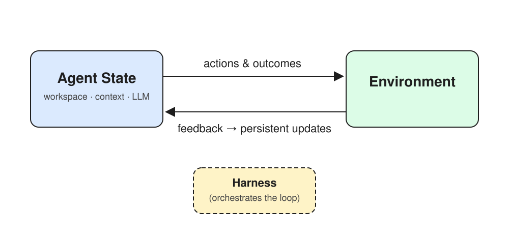

# Self-Evolving Agent Daily

Notes, experiments, and reference materials on building self-evolving LLM agents.
构建自进化 LLM Agent 的日常笔记、实验与参考资料。

## The Core Loop / 核心闭环



> **English:** The agent acts on the environment; feedback flows back as persistent updates to agent state. The harness orchestrates the loop.
>
> **中文：** Agent 作用于外部环境，反馈回流为对 Agent 内部状态的持久化更新，由 Harness 编排整个闭环。

## Contents / 内容

| Path / 路径 | Description / 说明 |
|---|---|
| [`docs/designing-self-evolving-agents-reference.md`](docs/designing-self-evolving-agents-reference.md) | Bilingual content reference for the talk "Building Self-Evolving LLM Agents"（《构建自进化的 LLM Agent》演示文稿双语内容参考） |
| [`assets/self-evolution-loop.excalidraw`](assets/self-evolution-loop.excalidraw) | Editable source of the loop diagram (open in [excalidraw.com](https://excalidraw.com))（闭环图的可编辑源文件） |
| [`assets/self-evolution-loop.svg`](assets/self-evolution-loop.svg) | Rendered loop diagram（闭环图渲染图） |

## Structure / 仓库结构

```text
docs/        参考资料与文档 / reference materials
assets/      图表资源 / diagram assets
LICENSE      Apache License 2.0
```
