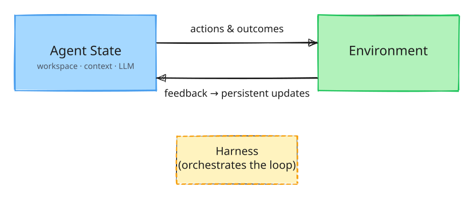

# Self-Evolving Agent Daily

Notes, experiments, and reference materials on building self-evolving LLM agents.

> **[简体中文](README.zh-CN.md) · English**

## The Core Loop



> The agent acts on the environment; feedback flows back as persistent updates to agent state. The harness orchestrates the loop.

## Contents

| Path | Description |
|---|---|
| [`docs/designing-self-evolving-agents-reference.md`](docs/designing-self-evolving-agents-reference.md) | Content reference for the talk "Building Self-Evolving LLM Agents" |
| [`assets/self-evolution-loop.en.excalidraw`](assets/self-evolution-loop.en.excalidraw) | Editable source of the loop diagram, English (open in [excalidraw.com](https://excalidraw.com)) |
| [`assets/self-evolution-loop.en.svg`](assets/self-evolution-loop.en.svg) | Rendered loop diagram, English |
| [`assets/self-evolution-loop.zh.excalidraw`](assets/self-evolution-loop.zh.excalidraw) | Editable source of the loop diagram, Chinese (open in [excalidraw.com](https://excalidraw.com)) |
| [`assets/self-evolution-loop.zh.svg`](assets/self-evolution-loop.zh.svg) | Rendered loop diagram, Chinese |

## Structure

```text
docs/        reference materials
assets/      diagram assets
LICENSE      Apache License 2.0
```
