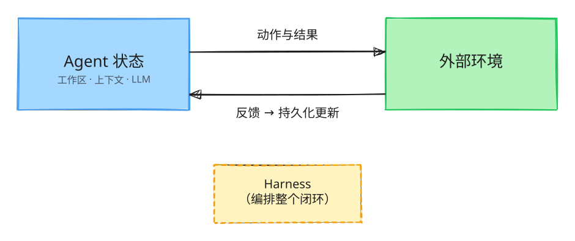

# Self-Evolving Agent Daily

构建自进化 LLM Agent 的日常笔记、实验与参考资料。

> **[English](README.md) · 简体中文**

## 核心闭环



> Agent 作用于外部环境，反馈回流为对 Agent 内部状态的持久化更新，由 Harness 编排整个闭环。

## 内容

| 路径 | 说明 |
|---|---|
| [`docs/designing-self-evolving-agents-reference.md`](docs/designing-self-evolving-agents-reference.md) | 《构建自进化的 LLM Agent》演示文稿双语内容参考 |
| [`assets/self-evolution-loop.en.excalidraw`](assets/self-evolution-loop.en.excalidraw) | 闭环图可编辑源文件（英文），可在 [excalidraw.com](https://excalidraw.com) 打开 |
| [`assets/self-evolution-loop.en.svg`](assets/self-evolution-loop.en.svg) | 闭环图渲染图（英文） |
| [`assets/self-evolution-loop.zh.excalidraw`](assets/self-evolution-loop.zh.excalidraw) | 闭环图可编辑源文件（中文），可在 [excalidraw.com](https://excalidraw.com) 打开 |
| [`assets/self-evolution-loop.zh.svg`](assets/self-evolution-loop.zh.svg) | 闭环图渲染图（中文） |

## 仓库结构

```text
docs/        参考资料与文档
assets/      图表资源
LICENSE      Apache License 2.0
```

## 开发说明

本项目完全由 [PenguinHarness](https://github.com/Prism-Shadow/penguin-harness) + DeepSeek V4 Flash 开发。
